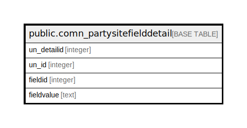

# public.comn_partysitefielddetail

## Description

## Columns

| Name | Type | Default | Nullable | Children | Parents | Comment |
| ---- | ---- | ------- | -------- | -------- | ------- | ------- |
| un_detailid | integer | nextval('comn_partysitefielddetail_un_detailid_seq'::regclass) | false |  |  |  |
| un_id | integer |  | true |  |  |  |
| fieldid | integer |  | true |  |  |  |
| fieldvalue | text |  | true |  |  |  |

## Constraints

| Name | Type | Definition |
| ---- | ---- | ---------- |
| comn_partysitefielddetail_pkey | PRIMARY KEY | PRIMARY KEY (un_detailid) |

## Indexes

| Name | Definition |
| ---- | ---------- |
| comn_partysitefielddetail_pkey | CREATE UNIQUE INDEX comn_partysitefielddetail_pkey ON public.comn_partysitefielddetail USING btree (un_detailid) |
| Index_Party_Site_FieldDet | CREATE INDEX "Index_Party_Site_FieldDet" ON public.comn_partysitefielddetail USING btree (un_id) |

## Relations

---

> Generated by [tbls](https://github.com/k1LoW/tbls)
