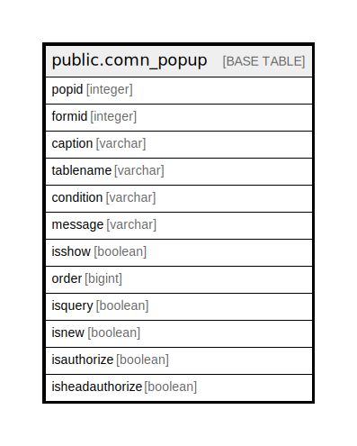

# public.comn_popup

## Description

## Columns

| Name | Type | Default | Nullable | Children | Parents | Comment |
| ---- | ---- | ------- | -------- | -------- | ------- | ------- |
| popid | integer |  | false |  |  |  |
| formid | integer |  | false |  |  |  |
| caption | varchar |  | true |  |  |  |
| tablename | varchar |  | false |  |  |  |
| condition | varchar |  | true |  |  |  |
| message | varchar |  | true |  |  |  |
| isshow | boolean | true | false |  |  |  |
| order | bigint |  | true |  |  |  |
| isquery | boolean | false | false |  |  |  |
| isnew | boolean | false | true |  |  |  |
| isauthorize | boolean | false | true |  |  |  |
| isheadauthorize | boolean | false | true |  |  |  |

## Constraints

| Name | Type | Definition |
| ---- | ---- | ---------- |
| comn_popup_pkey | PRIMARY KEY | PRIMARY KEY (popid) |

## Indexes

| Name | Definition |
| ---- | ---------- |
| comn_popup_pkey | CREATE UNIQUE INDEX comn_popup_pkey ON public.comn_popup USING btree (popid) |

## Relations

---

> Generated by [tbls](https://github.com/k1LoW/tbls)
