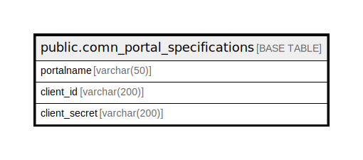

# public.comn_portal_specifications

## Description

## Columns

| Name | Type | Default | Nullable | Children | Parents | Comment |
| ---- | ---- | ------- | -------- | -------- | ------- | ------- |
| portalname | varchar(50) |  | false |  |  |  |
| client_id | varchar(200) |  | true |  |  |  |
| client_secret | varchar(200) |  | true |  |  |  |

## Constraints

| Name | Type | Definition |
| ---- | ---- | ---------- |
| comn_portal_specifications_pkey | PRIMARY KEY | PRIMARY KEY (portalname) |

## Indexes

| Name | Definition |
| ---- | ---------- |
| comn_portal_specifications_pkey | CREATE UNIQUE INDEX comn_portal_specifications_pkey ON public.comn_portal_specifications USING btree (portalname) |

## Relations

---

> Generated by [tbls](https://github.com/k1LoW/tbls)
