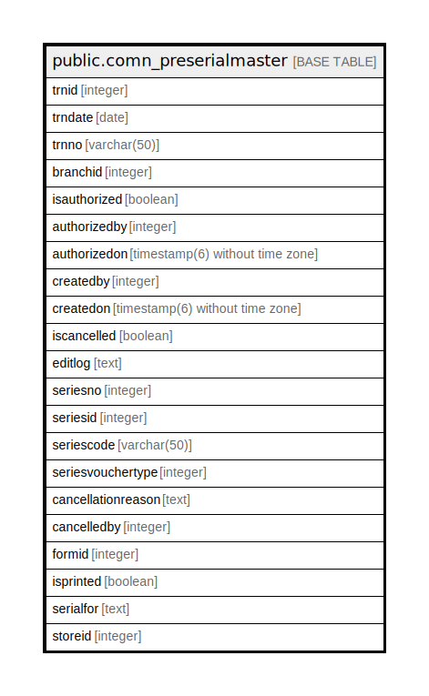

# public.comn_preserialmaster

## Description

## Columns

| Name | Type | Default | Nullable | Children | Parents | Comment |
| ---- | ---- | ------- | -------- | -------- | ------- | ------- |
| trnid | integer | nextval('comn_preserialmaster_trnid_seq'::regclass) | false |  |  |  |
| trndate | date |  | true |  |  |  |
| trnno | varchar(50) |  | true |  |  |  |
| branchid | integer |  | true |  |  |  |
| isauthorized | boolean | false | false |  |  |  |
| authorizedby | integer |  | true |  |  |  |
| authorizedon | timestamp(6) without time zone |  | true |  |  |  |
| createdby | integer |  | true |  |  |  |
| createdon | timestamp(6) without time zone | now() | true |  |  |  |
| iscancelled | boolean | false | true |  |  |  |
| editlog | text |  | true |  |  |  |
| seriesno | integer |  | true |  |  |  |
| seriesid | integer |  | true |  |  |  |
| seriescode | varchar(50) |  | true |  |  |  |
| seriesvouchertype | integer |  | true |  |  |  |
| cancellationreason | text |  | true |  |  |  |
| cancelledby | integer |  | true |  |  |  |
| formid | integer | 85 | false |  |  |  |
| isprinted | boolean | false | true |  |  |  |
| serialfor | text | 'Production'::text | true |  |  |  |
| storeid | integer |  | true |  |  |  |

## Constraints

| Name | Type | Definition |
| ---- | ---- | ---------- |
| comn_preserialmater_pkey | PRIMARY KEY | PRIMARY KEY (trnid) |

## Indexes

| Name | Definition |
| ---- | ---------- |
| comn_preserialmater_pkey | CREATE UNIQUE INDEX comn_preserialmater_pkey ON public.comn_preserialmaster USING btree (trnid) |

## Relations

---

> Generated by [tbls](https://github.com/k1LoW/tbls)
