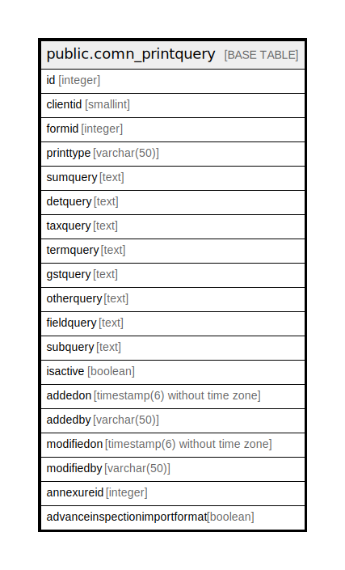

# public.comn_printquery

## Description

## Columns

| Name | Type | Default | Nullable | Children | Parents | Comment |
| ---- | ---- | ------- | -------- | -------- | ------- | ------- |
| id | integer | nextval('"Comn_PrintQuery_ID_seq"'::regclass) | false |  |  |  |
| clientid | smallint |  | false |  |  |  |
| formid | integer |  | false |  |  |  |
| printtype | varchar(50) |  | false |  |  |  |
| sumquery | text |  | true |  |  |  |
| detquery | text |  | true |  |  |  |
| taxquery | text |  | true |  |  |  |
| termquery | text |  | true |  |  |  |
| gstquery | text |  | true |  |  |  |
| otherquery | text |  | true |  |  |  |
| fieldquery | text |  | true |  |  |  |
| subquery | text |  | true |  |  |  |
| isactive | boolean | false | false |  |  |  |
| addedon | timestamp(6) without time zone | now() | false |  |  |  |
| addedby | varchar(50) |  | true |  |  |  |
| modifiedon | timestamp(6) without time zone | now() | true |  |  |  |
| modifiedby | varchar(50) |  | true |  |  |  |
| annexureid | integer | 0 | false |  |  |  |
| advanceinspectionimportformat | boolean | false | false |  |  |  |

## Constraints

| Name | Type | Definition |
| ---- | ---- | ---------- |
| comn_printquery_id_key | UNIQUE | UNIQUE (id) |
| comn_printquery_pkey | PRIMARY KEY | PRIMARY KEY (clientid, formid, isactive, printtype, annexureid, advanceinspectionimportformat) |

## Indexes

| Name | Definition |
| ---- | ---------- |
| comn_printquery_id_key | CREATE UNIQUE INDEX comn_printquery_id_key ON public.comn_printquery USING btree (id) |
| comn_printquery_pkey | CREATE UNIQUE INDEX comn_printquery_pkey ON public.comn_printquery USING btree (clientid, formid, isactive, printtype, annexureid, advanceinspectionimportformat) |

## Relations

---

> Generated by [tbls](https://github.com/k1LoW/tbls)
