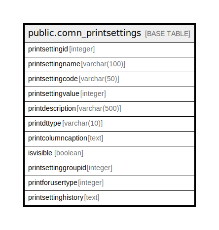

# public.comn_printsettings

## Description

## Columns

| Name | Type | Default | Nullable | Children | Parents | Comment |
| ---- | ---- | ------- | -------- | -------- | ------- | ------- |
| printsettingid | integer |  | false |  |  |  |
| printsettingname | varchar(100) |  | true |  |  |  |
| printsettingcode | varchar(50) |  | true |  |  |  |
| printsettingvalue | integer |  | true |  |  |  |
| printdescription | varchar(500) |  | true |  |  |  |
| printdttype | varchar(10) |  | true |  |  |  |
| printcolumncaption | text |  | true |  |  |  |
| isvisible | boolean | false | false |  |  |  |
| printsettinggroupid | integer | 6 | true |  |  |  |
| printforusertype | integer | 1 | true |  |  |  |
| printsettinghistory | text |  | true |  |  |  |

## Constraints

| Name | Type | Definition |
| ---- | ---- | ---------- |
| comn_printsettings_pkey | PRIMARY KEY | PRIMARY KEY (printsettingid) |

## Indexes

| Name | Definition |
| ---- | ---------- |
| comn_printsettings_pkey | CREATE UNIQUE INDEX comn_printsettings_pkey ON public.comn_printsettings USING btree (printsettingid) |

## Relations

---

> Generated by [tbls](https://github.com/k1LoW/tbls)
