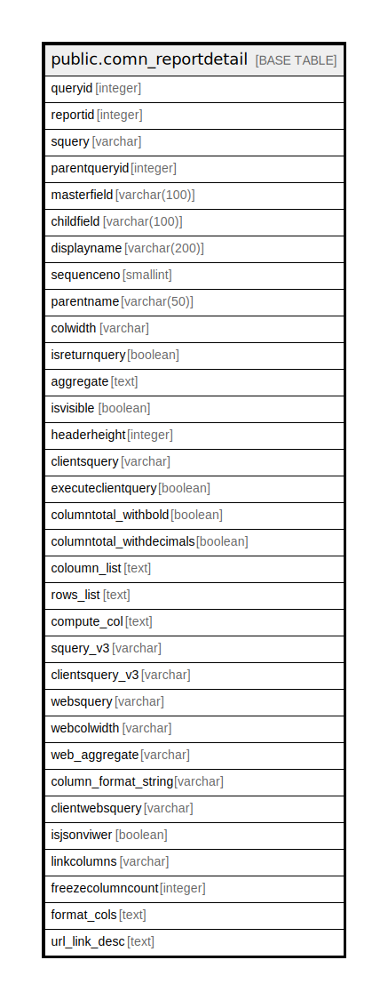

# public.comn_reportdetail

## Description

## Columns

| Name | Type | Default | Nullable | Children | Parents | Comment |
| ---- | ---- | ------- | -------- | -------- | ------- | ------- |
| queryid | integer |  | false |  |  |  |
| reportid | integer |  | true |  |  |  |
| squery | varchar |  | true |  |  |  |
| parentqueryid | integer |  | true |  |  |  |
| masterfield | varchar(100) |  | true |  |  |  |
| childfield | varchar(100) |  | true |  |  |  |
| displayname | varchar(200) |  | true |  |  |  |
| sequenceno | smallint | 1 | true |  |  |  |
| parentname | varchar(50) |  | true |  |  |  |
| colwidth | varchar |  | true |  |  |  |
| isreturnquery | boolean | false | false |  |  |  |
| aggregate | text | NULL::character varying | true |  |  |  |
| isvisible | boolean | true | true |  |  |  |
| headerheight | integer | 40 | true |  |  |  |
| clientsquery | varchar |  | true |  |  |  |
| executeclientquery | boolean | false | true |  |  |  |
| columntotal_withbold | boolean | false | true |  |  |  |
| columntotal_withdecimals | boolean | false | true |  |  |  |
| coloumn_list | text |  | true |  |  |  |
| rows_list | text |  | true |  |  |  |
| compute_col | text |  | true |  |  |  |
| squery_v3 | varchar |  | true |  |  |  |
| clientsquery_v3 | varchar |  | true |  |  |  |
| websquery | varchar |  | true |  |  |  |
| webcolwidth | varchar |  | true |  |  |  |
| web_aggregate | varchar |  | true |  |  |  |
| column_format_string | varchar |  | true |  |  |  |
| clientwebsquery | varchar |  | true |  |  |  |
| isjsonviwer | boolean | false | false |  |  |  |
| linkcolumns | varchar |  | true |  |  |  |
| freezecolumncount | integer |  | true |  |  |  |
| format_cols | text |  | true |  |  |  |
| url_link_desc | text | ''::text | true |  |  |  |

## Constraints

| Name | Type | Definition |
| ---- | ---- | ---------- |
| comn_reportdetail_pkey | PRIMARY KEY | PRIMARY KEY (queryid) |

## Indexes

| Name | Definition |
| ---- | ---------- |
| comn_reportdetail_pkey | CREATE UNIQUE INDEX comn_reportdetail_pkey ON public.comn_reportdetail USING btree (queryid) |

## Relations

---

> Generated by [tbls](https://github.com/k1LoW/tbls)
