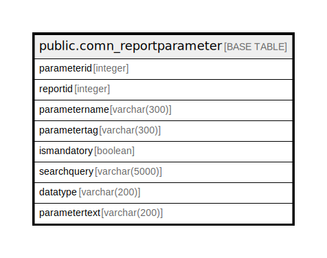

# public.comn_reportparameter

## Description

## Columns

| Name | Type | Default | Nullable | Children | Parents | Comment |
| ---- | ---- | ------- | -------- | -------- | ------- | ------- |
| parameterid | integer | nextval('comn_reportparameter_parameterid_seq'::regclass) | false |  |  |  |
| reportid | integer |  | true |  |  |  |
| parametername | varchar(300) |  | true |  |  |  |
| parametertag | varchar(300) |  | true |  |  |  |
| ismandatory | boolean | false | true |  |  |  |
| searchquery | varchar(5000) |  | true |  |  |  |
| datatype | varchar(200) |  | true |  |  |  |
| parametertext | varchar(200) |  | true |  |  |  |

## Constraints

| Name | Type | Definition |
| ---- | ---- | ---------- |
| comn_reportparameter_pkey | PRIMARY KEY | PRIMARY KEY (parameterid) |

## Indexes

| Name | Definition |
| ---- | ---------- |
| comn_reportparameter_pkey | CREATE UNIQUE INDEX comn_reportparameter_pkey ON public.comn_reportparameter USING btree (parameterid) |

## Relations

---

> Generated by [tbls](https://github.com/k1LoW/tbls)
