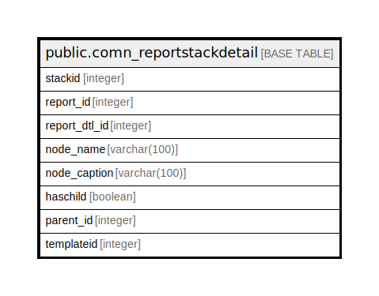

# public.comn_reportstackdetail

## Description

## Columns

| Name | Type | Default | Nullable | Children | Parents | Comment |
| ---- | ---- | ------- | -------- | -------- | ------- | ------- |
| stackid | integer | nextval('comn_reportstackdetail_stackid_seq'::regclass) | false |  |  |  |
| report_id | integer |  | false |  |  |  |
| report_dtl_id | integer |  | false |  |  |  |
| node_name | varchar(100) |  | false |  |  |  |
| node_caption | varchar(100) |  | true |  |  |  |
| haschild | boolean | false | false |  |  |  |
| parent_id | integer |  | true |  |  |  |
| templateid | integer |  | true |  |  |  |

## Constraints

| Name | Type | Definition |
| ---- | ---- | ---------- |
| comn_reportstackdetail_pkey | PRIMARY KEY | PRIMARY KEY (stackid) |

## Indexes

| Name | Definition |
| ---- | ---------- |
| comn_reportstackdetail_pkey | CREATE UNIQUE INDEX comn_reportstackdetail_pkey ON public.comn_reportstackdetail USING btree (stackid) |

## Relations

---

> Generated by [tbls](https://github.com/k1LoW/tbls)
