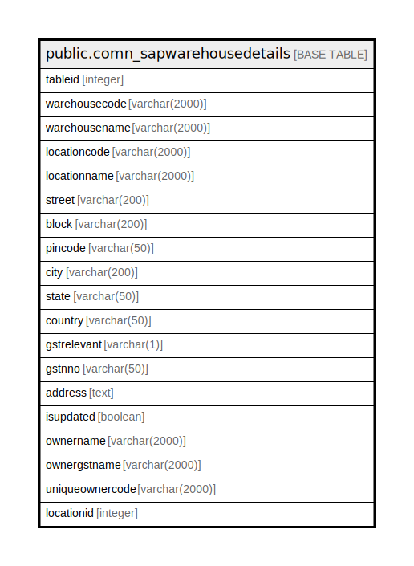

# public.comn_sapwarehousedetails

## Description

## Columns

| Name | Type | Default | Nullable | Children | Parents | Comment |
| ---- | ---- | ------- | -------- | -------- | ------- | ------- |
| tableid | integer |  | false |  |  |  |
| warehousecode | varchar(2000) |  | true |  |  |  |
| warehousename | varchar(2000) |  | true |  |  |  |
| locationcode | varchar(2000) |  | true |  |  |  |
| locationname | varchar(2000) |  | true |  |  |  |
| street | varchar(200) |  | true |  |  |  |
| block | varchar(200) |  | true |  |  |  |
| pincode | varchar(50) |  | true |  |  |  |
| city | varchar(200) |  | true |  |  |  |
| state | varchar(50) |  | true |  |  |  |
| country | varchar(50) |  | true |  |  |  |
| gstrelevant | varchar(1) |  | true |  |  |  |
| gstnno | varchar(50) |  | true |  |  |  |
| address | text |  | true |  |  |  |
| isupdated | boolean | false | true |  |  |  |
| ownername | varchar(2000) |  | true |  |  |  |
| ownergstname | varchar(2000) |  | true |  |  |  |
| uniqueownercode | varchar(2000) |  | true |  |  |  |
| locationid | integer |  | true |  |  |  |

## Constraints

| Name | Type | Definition |
| ---- | ---- | ---------- |
| comn_sapwarehousedetails_pkey | PRIMARY KEY | PRIMARY KEY (tableid) |

## Indexes

| Name | Definition |
| ---- | ---------- |
| comn_sapwarehousedetails_pkey | CREATE UNIQUE INDEX comn_sapwarehousedetails_pkey ON public.comn_sapwarehousedetails USING btree (tableid) |

## Relations

---

> Generated by [tbls](https://github.com/k1LoW/tbls)
