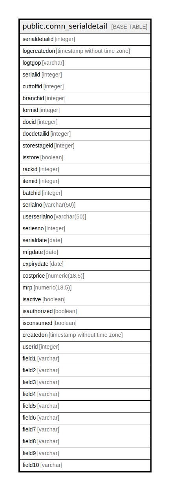

# public.comn_serialdetail

## Description

History of each serial Update/Insert/Delete.

## Columns

| Name | Type | Default | Nullable | Children | Parents | Comment |
| ---- | ---- | ------- | -------- | -------- | ------- | ------- |
| serialdetailid | integer | nextval('seq_serialdetailid'::regclass) | true |  |  |  |
| logcreatedon | timestamp without time zone | now() | false |  |  |  |
| logtgop | varchar |  | false |  |  | Trigger will capture the operation type(Update/Insert/Delete). |
| serialid | integer |  | false |  |  |  |
| cuttoffid | integer | 0 | false |  |  |  |
| branchid | integer |  | false |  |  |  |
| formid | integer |  | false |  |  |  |
| docid | integer |  | false |  |  |  |
| docdetailid | integer |  | false |  |  |  |
| storestageid | integer |  | false |  |  |  |
| isstore | boolean |  | false |  |  |  |
| rackid | integer |  | false |  |  |  |
| itemid | integer |  | false |  |  |  |
| batchid | integer |  | false |  |  |  |
| serialno | varchar(50) |  | true |  |  |  |
| userserialno | varchar(50) |  | true |  |  |  |
| seriesno | integer |  | false |  |  |  |
| serialdate | date |  | false |  |  |  |
| mfgdate | date |  | false |  |  |  |
| expirydate | date |  | false |  |  |  |
| costprice | numeric(18,5) |  | false |  |  |  |
| mrp | numeric(18,5) |  | false |  |  |  |
| isactive | boolean |  | false |  |  |  |
| isauthorized | boolean |  | false |  |  |  |
| isconsumed | boolean |  | false |  |  |  |
| createdon | timestamp without time zone |  | false |  |  |  |
| userid | integer |  | false |  |  |  |
| field1 | varchar |  | true |  |  |  |
| field2 | varchar |  | true |  |  |  |
| field3 | varchar |  | true |  |  |  |
| field4 | varchar |  | true |  |  |  |
| field5 | varchar |  | true |  |  |  |
| field6 | varchar |  | true |  |  |  |
| field7 | varchar |  | true |  |  |  |
| field8 | varchar |  | true |  |  |  |
| field9 | varchar |  | true |  |  |  |
| field10 | varchar |  | true |  |  |  |

## Relations

---

> Generated by [tbls](https://github.com/k1LoW/tbls)
