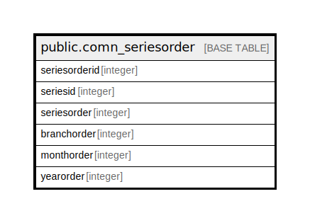

# public.comn_seriesorder

## Description

## Columns

| Name | Type | Default | Nullable | Children | Parents | Comment |
| ---- | ---- | ------- | -------- | -------- | ------- | ------- |
| seriesorderid | integer | nextval('comn_seriesorder_seriesorderid_seq'::regclass) | false |  |  |  |
| seriesid | integer |  | true |  |  |  |
| seriesorder | integer |  | true |  |  |  |
| branchorder | integer |  | true |  |  |  |
| monthorder | integer |  | true |  |  |  |
| yearorder | integer |  | true |  |  |  |

## Constraints

| Name | Type | Definition |
| ---- | ---- | ---------- |
| seriesorder_pkey | PRIMARY KEY | PRIMARY KEY (seriesorderid) |

## Indexes

| Name | Definition |
| ---- | ---------- |
| seriesorder_pkey | CREATE UNIQUE INDEX seriesorder_pkey ON public.comn_seriesorder USING btree (seriesorderid) |

## Relations

---

> Generated by [tbls](https://github.com/k1LoW/tbls)
