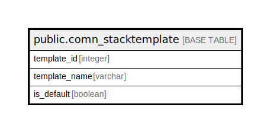

# public.comn_stacktemplate

## Description

## Columns

| Name | Type | Default | Nullable | Children | Parents | Comment |
| ---- | ---- | ------- | -------- | -------- | ------- | ------- |
| template_id | integer | nextval('comn_stacktemplate_template_id_seq'::regclass) | false |  |  |  |
| template_name | varchar |  | true |  |  |  |
| is_default | boolean |  | true |  |  |  |

## Constraints

| Name | Type | Definition |
| ---- | ---- | ---------- |
| comn_stacktemplate_pkey | PRIMARY KEY | PRIMARY KEY (template_id) |

## Indexes

| Name | Definition |
| ---- | ---------- |
| comn_stacktemplate_pkey | CREATE UNIQUE INDEX comn_stacktemplate_pkey ON public.comn_stacktemplate USING btree (template_id) |

## Relations

---

> Generated by [tbls](https://github.com/k1LoW/tbls)
