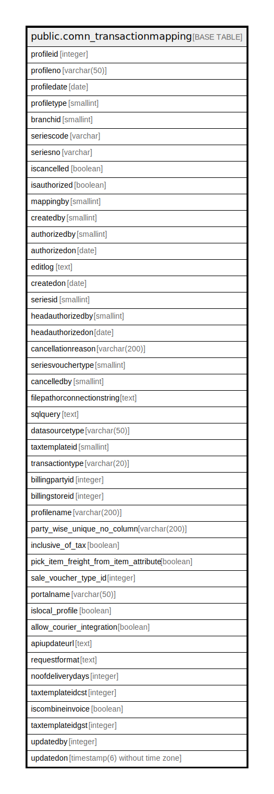

# public.comn_transactionmapping

## Description

## Columns

| Name | Type | Default | Nullable | Children | Parents | Comment |
| ---- | ---- | ------- | -------- | -------- | ------- | ------- |
| profileid | integer | nextval('comn_transactionmapping_profileid_seq'::regclass) | false |  |  |  |
| profileno | varchar(50) |  | false |  |  |  |
| profiledate | date |  | true |  |  |  |
| profiletype | smallint |  | true |  |  |  |
| branchid | smallint |  | true |  |  |  |
| seriescode | varchar |  | true |  |  |  |
| seriesno | varchar |  | true |  |  |  |
| iscancelled | boolean |  | true |  |  |  |
| isauthorized | boolean |  | true |  |  |  |
| mappingby | smallint |  | true |  |  |  |
| createdby | smallint |  | true |  |  |  |
| authorizedby | smallint |  | true |  |  |  |
| authorizedon | date |  | true |  |  |  |
| editlog | text |  | true |  |  |  |
| createdon | date |  | true |  |  |  |
| seriesid | smallint |  | true |  |  |  |
| headauthorizedby | smallint |  | true |  |  |  |
| headauthorizedon | date |  | true |  |  |  |
| cancellationreason | varchar(200) |  | true |  |  |  |
| seriesvouchertype | smallint |  | true |  |  |  |
| cancelledby | smallint |  | true |  |  |  |
| filepathorconnectionstring | text |  | true |  |  |  |
| sqlquery | text |  | true |  |  |  |
| datasourcetype | varchar(50) |  | true |  |  |  |
| taxtemplateid | smallint |  | true |  |  |  |
| transactiontype | varchar(20) |  | true |  |  |  |
| billingpartyid | integer | 0 | true |  |  |  |
| billingstoreid | integer | 0 | true |  |  |  |
| profilename | varchar(200) |  | true |  |  |  |
| party_wise_unique_no_column | varchar(200) |  | true |  |  |  |
| inclusive_of_tax | boolean | false | true |  |  |  |
| pick_item_freight_from_item_attribute | boolean | false | true |  |  |  |
| sale_voucher_type_id | integer | 0 | true |  |  |  |
| portalname | varchar(50) | ''::character varying | true |  |  |  |
| islocal_profile | boolean | false | true |  |  |  |
| allow_courier_integration | boolean |  | true |  |  |  |
| apiupdateurl | text |  | true |  |  |  |
| requestformat | text |  | true |  |  |  |
| noofdeliverydays | integer |  | true |  |  |  |
| taxtemplateidcst | integer |  | true |  |  |  |
| iscombineinvoice | boolean | false | false |  |  |  |
| taxtemplateidgst | integer | 0 | false |  |  |  |
| updatedby | integer |  | true |  |  |  |
| updatedon | timestamp(6) without time zone | NULL::timestamp without time zone | true |  |  |  |

## Constraints

| Name | Type | Definition |
| ---- | ---- | ---------- |
| comn_transactionmapping_pkey | PRIMARY KEY | PRIMARY KEY (profileid) |

## Indexes

| Name | Definition |
| ---- | ---------- |
| comn_transactionmapping_pkey | CREATE UNIQUE INDEX comn_transactionmapping_pkey ON public.comn_transactionmapping USING btree (profileid) |

## Relations

---

> Generated by [tbls](https://github.com/k1LoW/tbls)
