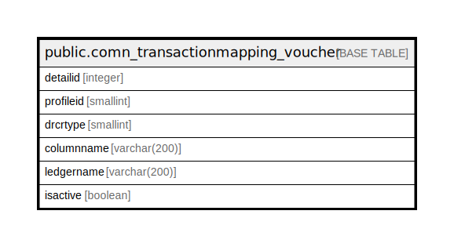

# public.comn_transactionmapping_voucher

## Description

## Columns

| Name | Type | Default | Nullable | Children | Parents | Comment |
| ---- | ---- | ------- | -------- | -------- | ------- | ------- |
| detailid | integer | nextval('comn_transactionmapping_voucher_detailid_seq'::regclass) | false |  |  |  |
| profileid | smallint |  | false |  |  |  |
| drcrtype | smallint |  | false |  |  | 0 for Dr and 1 for Cr |
| columnname | varchar(200) |  | false |  |  |  |
| ledgername | varchar(200) |  | false |  |  |  |
| isactive | boolean |  | false |  |  |  |

## Constraints

| Name | Type | Definition |
| ---- | ---- | ---------- |
| comn_transactionmapping_voucher_pkey | PRIMARY KEY | PRIMARY KEY (detailid) |

## Indexes

| Name | Definition |
| ---- | ---------- |
| comn_transactionmapping_voucher_pkey | CREATE UNIQUE INDEX comn_transactionmapping_voucher_pkey ON public.comn_transactionmapping_voucher USING btree (detailid) |

## Relations

---

> Generated by [tbls](https://github.com/k1LoW/tbls)
