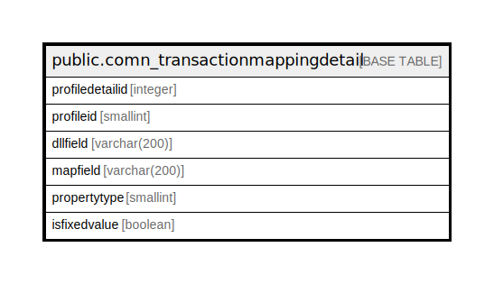

# public.comn_transactionmappingdetail

## Description

## Columns

| Name | Type | Default | Nullable | Children | Parents | Comment |
| ---- | ---- | ------- | -------- | -------- | ------- | ------- |
| profiledetailid | integer | nextval('comn_transactionmappingdetail_profiledetailid_seq'::regclass) | false |  |  |  |
| profileid | smallint |  | true |  |  |  |
| dllfield | varchar(200) |  | true |  |  |  |
| mapfield | varchar(200) |  | true |  |  |  |
| propertytype | smallint |  | true |  |  |  |
| isfixedvalue | boolean | false | true |  |  |  |

## Constraints

| Name | Type | Definition |
| ---- | ---- | ---------- |
| comn_transactionmapping-detail_pkey | PRIMARY KEY | PRIMARY KEY (profiledetailid) |

## Indexes

| Name | Definition |
| ---- | ---------- |
| comn_transactionmapping-detail_pkey | CREATE UNIQUE INDEX "comn_transactionmapping-detail_pkey" ON public.comn_transactionmappingdetail USING btree (profiledetailid) |

## Relations

---

> Generated by [tbls](https://github.com/k1LoW/tbls)
