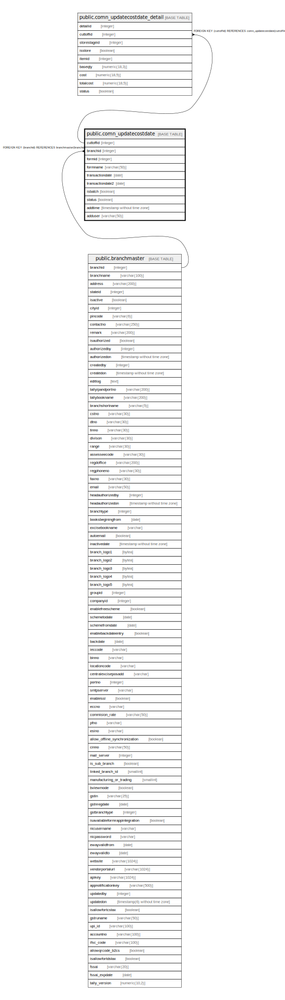

# public.comn_updatecostdate

## Description

## Columns

| Name | Type | Default | Nullable | Children | Parents | Comment |
| ---- | ---- | ------- | -------- | -------- | ------- | ------- |
| cuttoffid | integer | nextval('seq_comn_updatecostdate_id'::regclass) | false | [public.comn_updatecostdate_detail](public.comn_updatecostdate_detail.md) |  |  |
| branchid | integer |  | false |  | [public.branchmaster](public.branchmaster.md) |  |
| formid | integer |  | false |  |  |  |
| formname | varchar(50) |  | true |  |  |  |
| transactiondate | date |  | false |  |  |  |
| transactiondate2 | date |  | true |  |  |  |
| isbatch | boolean | false | false |  |  |  |
| status | boolean | true | false |  |  |  |
| addtime | timestamp without time zone | now() | false |  |  |  |
| adduser | varchar(50) |  | false |  |  |  |

## Constraints

| Name | Type | Definition |
| ---- | ---- | ---------- |
| comn_updatecostdate_branchid_fkey | FOREIGN KEY | FOREIGN KEY (branchid) REFERENCES branchmaster(branchid) |
| comn_updatecostdate_cuttoffid_key | UNIQUE | UNIQUE (cuttoffid) |
| pk_seq_comn_updatecostdate | PRIMARY KEY | PRIMARY KEY (branchid, transactiondate, status, isbatch) |

## Indexes

| Name | Definition |
| ---- | ---------- |
| comn_updatecostdate_cuttoffid_key | CREATE UNIQUE INDEX comn_updatecostdate_cuttoffid_key ON public.comn_updatecostdate USING btree (cuttoffid) |
| pk_seq_comn_updatecostdate | CREATE UNIQUE INDEX pk_seq_comn_updatecostdate ON public.comn_updatecostdate USING btree (branchid, transactiondate, status, isbatch) |

## Relations

---

> Generated by [tbls](https://github.com/k1LoW/tbls)
