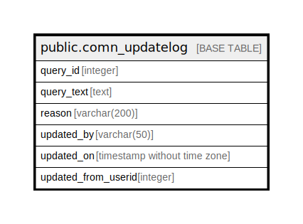

# public.comn_updatelog

## Description

## Columns

| Name | Type | Default | Nullable | Children | Parents | Comment |
| ---- | ---- | ------- | -------- | -------- | ------- | ------- |
| query_id | integer | nextval('comn_updatelog_query_id_seq'::regclass) | false |  |  |  |
| query_text | text |  | false |  |  |  |
| reason | varchar(200) |  | true |  |  |  |
| updated_by | varchar(50) |  | true |  |  |  |
| updated_on | timestamp without time zone | now() | true |  |  |  |
| updated_from_userid | integer |  | true |  |  |  |

## Constraints

| Name | Type | Definition |
| ---- | ---- | ---------- |
| comn_updatelog_pkey | PRIMARY KEY | PRIMARY KEY (query_id) |

## Indexes

| Name | Definition |
| ---- | ---------- |
| comn_updatelog_pkey | CREATE UNIQUE INDEX comn_updatelog_pkey ON public.comn_updatelog USING btree (query_id) |

## Relations

---

> Generated by [tbls](https://github.com/k1LoW/tbls)
