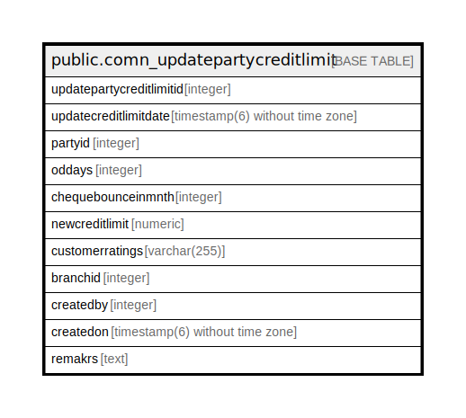

# public.comn_updatepartycreditlimit

## Description

## Columns

| Name | Type | Default | Nullable | Children | Parents | Comment |
| ---- | ---- | ------- | -------- | -------- | ------- | ------- |
| updatepartycreditlimitid | integer | nextval('comn_updatepartycreditlimit_updatepartycreditlimitid_seq'::regclass) | false |  |  |  |
| updatecreditlimitdate | timestamp(6) without time zone |  | true |  |  |  |
| partyid | integer | 0 | false |  |  |  |
| oddays | integer | 0 | false |  |  |  |
| chequebounceinmnth | integer | 0 | false |  |  |  |
| newcreditlimit | numeric | 0 | false |  |  |  |
| customerratings | varchar(255) | ''::character varying | false |  |  |  |
| branchid | integer | 0 | false |  |  |  |
| createdby | integer | 0 | false |  |  |  |
| createdon | timestamp(6) without time zone |  | true |  |  |  |
| remakrs | text |  | true |  |  |  |

## Constraints

| Name | Type | Definition |
| ---- | ---- | ---------- |
| comn_updatepartycreditlimit_pkey | PRIMARY KEY | PRIMARY KEY (updatepartycreditlimitid) |

## Indexes

| Name | Definition |
| ---- | ---------- |
| comn_updatepartycreditlimit_pkey | CREATE UNIQUE INDEX comn_updatepartycreditlimit_pkey ON public.comn_updatepartycreditlimit USING btree (updatepartycreditlimitid) |

## Relations

---

> Generated by [tbls](https://github.com/k1LoW/tbls)
