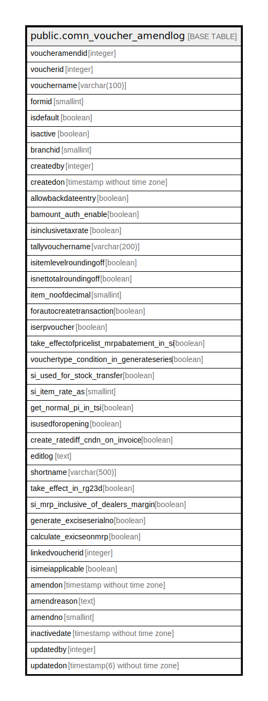

# public.comn_voucher_amendlog

## Description

## Columns

| Name | Type | Default | Nullable | Children | Parents | Comment |
| ---- | ---- | ------- | -------- | -------- | ------- | ------- |
| voucheramendid | integer | nextval('comn_voucher_amendlog_voucheramendid_seq'::regclass) | false |  |  |  |
| voucherid | integer |  | true |  |  |  |
| vouchername | varchar(100) |  | true |  |  |  |
| formid | smallint |  | true |  |  |  |
| isdefault | boolean | false | true |  |  |  |
| isactive | boolean | false | true |  |  |  |
| branchid | smallint |  | true |  |  |  |
| createdby | integer |  | true |  |  |  |
| createdon | timestamp without time zone |  | true |  |  |  |
| allowbackdateentry | boolean | false | true |  |  |  |
| bamount_auth_enable | boolean | false | true |  |  |  |
| isinclusivetaxrate | boolean | false | true |  |  |  |
| tallyvouchername | varchar(200) |  | true |  |  |  |
| isitemlevelroundingoff | boolean | false | true |  |  |  |
| isnettotalroundingoff | boolean | false | true |  |  |  |
| item_noofdecimal | smallint | 0 | true |  |  |  |
| forautocreatetransaction | boolean | false | true |  |  |  |
| iserpvoucher | boolean | false | true |  |  |  |
| take_effectofpricelist_mrpabatement_in_si | boolean | false | true |  |  |  |
| vouchertype_condition_in_generateseries | boolean | true | true |  |  |  |
| si_used_for_stock_transfer | boolean | false | true |  |  |  |
| si_item_rate_as | smallint | 0 | true |  |  |  |
| get_normal_pi_in_tsi | boolean | false | true |  |  |  |
| isusedforopening | boolean |  | true |  |  |  |
| create_ratediff_cndn_on_invoice | boolean | false | true |  |  |  |
| editlog | text |  | true |  |  |  |
| shortname | varchar(500) |  | true |  |  |  |
| take_effect_in_rg23d | boolean | false | true |  |  |  |
| si_mrp_inclusive_of_dealers_margin | boolean | false | true |  |  |  |
| generate_exciseserialno | boolean | false | true |  |  |  |
| calculate_exicseonmrp | boolean | false | true |  |  |  |
| linkedvoucherid | integer | 0 | true |  |  |  |
| isimeiapplicable | boolean | false | true |  |  |  |
| amendon | timestamp without time zone |  | true |  |  |  |
| amendreason | text |  | true |  |  |  |
| amendno | smallint |  | true |  |  |  |
| inactivedate | timestamp without time zone |  | true |  |  |  |
| updatedby | integer |  | true |  |  |  |
| updatedon | timestamp(6) without time zone | NULL::timestamp without time zone | true |  |  |  |

## Constraints

| Name | Type | Definition |
| ---- | ---- | ---------- |
| comn_voucher_amendlog_pkey | PRIMARY KEY | PRIMARY KEY (voucheramendid) |

## Indexes

| Name | Definition |
| ---- | ---------- |
| comn_voucher_amendlog_pkey | CREATE UNIQUE INDEX comn_voucher_amendlog_pkey ON public.comn_voucher_amendlog USING btree (voucheramendid) |

## Relations

---

> Generated by [tbls](https://github.com/k1LoW/tbls)
