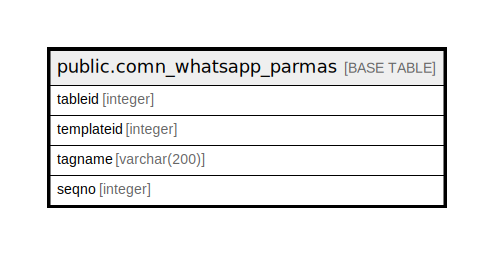

# public.comn_whatsapp_parmas

## Description

## Columns

| Name | Type | Default | Nullable | Children | Parents | Comment |
| ---- | ---- | ------- | -------- | -------- | ------- | ------- |
| tableid | integer | nextval('comn_whatsapp_parmas_tableid_seq'::regclass) | false |  |  |  |
| templateid | integer | 0 | true |  |  |  |
| tagname | varchar(200) |  | true |  |  |  |
| seqno | integer | 1 | true |  |  |  |

## Constraints

| Name | Type | Definition |
| ---- | ---- | ---------- |
| comn_whatsapp_parmas_pkey | PRIMARY KEY | PRIMARY KEY (tableid) |

## Indexes

| Name | Definition |
| ---- | ---------- |
| comn_whatsapp_parmas_pkey | CREATE UNIQUE INDEX comn_whatsapp_parmas_pkey ON public.comn_whatsapp_parmas USING btree (tableid) |

## Relations

---

> Generated by [tbls](https://github.com/k1LoW/tbls)
