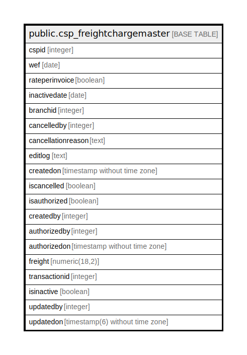

# public.csp_freightchargemaster

## Description

## Columns

| Name | Type | Default | Nullable | Children | Parents | Comment |
| ---- | ---- | ------- | -------- | -------- | ------- | ------- |
| cspid | integer |  | true |  |  |  |
| wef | date |  | true |  |  |  |
| rateperinvoice | boolean |  | true |  |  |  |
| inactivedate | date |  | true |  |  |  |
| branchid | integer |  | true |  |  |  |
| cancelledby | integer |  | true |  |  |  |
| cancellationreason | text |  | true |  |  |  |
| editlog | text |  | true |  |  |  |
| createdon | timestamp without time zone | now() | true |  |  |  |
| iscancelled | boolean | false | true |  |  |  |
| isauthorized | boolean | false | true |  |  |  |
| createdby | integer |  | true |  |  |  |
| authorizedby | integer |  | true |  |  |  |
| authorizedon | timestamp without time zone | now() | true |  |  |  |
| freight | numeric(18,2) |  | true |  |  |  |
| transactionid | integer | nextval('csp_freightchargemaster_transactionid_seq'::regclass) | false |  |  |  |
| isinactive | boolean |  | true |  |  |  |
| updatedby | integer |  | true |  |  |  |
| updatedon | timestamp(6) without time zone | NULL::timestamp without time zone | true |  |  |  |

## Relations

---

> Generated by [tbls](https://github.com/k1LoW/tbls)
