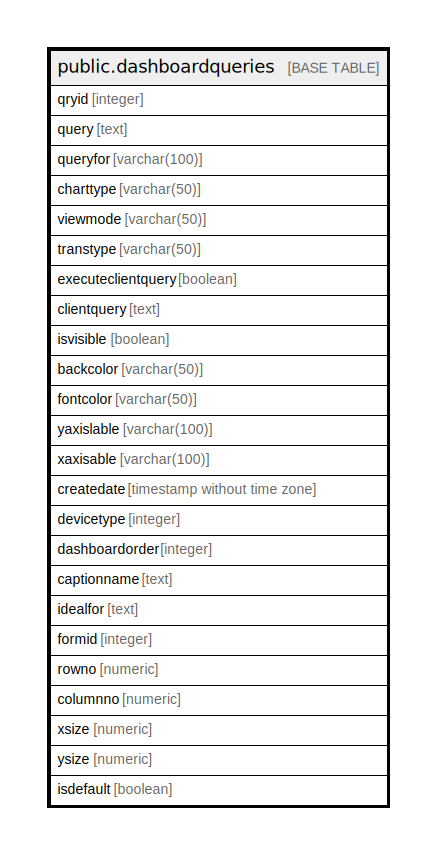

# public.dashboardqueries

## Description

## Columns

| Name | Type | Default | Nullable | Children | Parents | Comment |
| ---- | ---- | ------- | -------- | -------- | ------- | ------- |
| qryid | integer | nextval('dashboardqueries_qryid_seq'::regclass) | false |  |  |  |
| query | text |  | true |  |  |  |
| queryfor | varchar(100) |  | true |  |  |  |
| charttype | varchar(50) |  | true |  |  |  |
| viewmode | varchar(50) |  | true |  |  |  |
| transtype | varchar(50) |  | true |  |  |  |
| executeclientquery | boolean | false | true |  |  |  |
| clientquery | text |  | true |  |  |  |
| isvisible | boolean |  | true |  |  |  |
| backcolor | varchar(50) |  | true |  |  |  |
| fontcolor | varchar(50) |  | true |  |  |  |
| yaxislable | varchar(100) |  | true |  |  |  |
| xaxisable | varchar(100) |  | true |  |  |  |
| createdate | timestamp without time zone | now() | true |  |  |  |
| devicetype | integer | 0 | true |  |  |  |
| dashboardorder | integer | 0 | true |  |  |  |
| captionname | text |  | true |  |  |  |
| idealfor | text | 'ERPWin'::text | false |  |  |  |
| formid | integer |  | true |  |  |  |
| rowno | numeric |  | true |  |  |  |
| columnno | numeric |  | true |  |  |  |
| xsize | numeric |  | true |  |  |  |
| ysize | numeric |  | true |  |  |  |
| isdefault | boolean | false | true |  |  |  |

## Constraints

| Name | Type | Definition |
| ---- | ---- | ---------- |
| dashboardqueries_pkey | PRIMARY KEY | PRIMARY KEY (qryid) |

## Indexes

| Name | Definition |
| ---- | ---------- |
| dashboardqueries_pkey | CREATE UNIQUE INDEX dashboardqueries_pkey ON public.dashboardqueries USING btree (qryid) |

## Relations

---

> Generated by [tbls](https://github.com/k1LoW/tbls)
