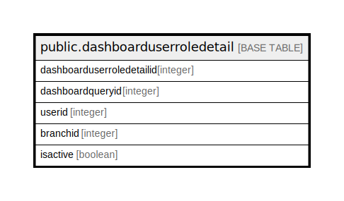

# public.dashboarduserroledetail

## Description

## Columns

| Name | Type | Default | Nullable | Children | Parents | Comment |
| ---- | ---- | ------- | -------- | -------- | ------- | ------- |
| dashboarduserroledetailid | integer | nextval('dashboarduserroledetail_dashboarduserroledetailid_seq'::regclass) | false |  |  |  |
| dashboardqueryid | integer |  | true |  |  |  |
| userid | integer |  | true |  |  |  |
| branchid | integer |  | true |  |  |  |
| isactive | boolean | false | true |  |  |  |

## Constraints

| Name | Type | Definition |
| ---- | ---- | ---------- |
| dashboarduserroledetail_pkey | PRIMARY KEY | PRIMARY KEY (dashboarduserroledetailid) |

## Indexes

| Name | Definition |
| ---- | ---------- |
| dashboarduserroledetail_pkey | CREATE UNIQUE INDEX dashboarduserroledetail_pkey ON public.dashboarduserroledetail USING btree (dashboarduserroledetailid) |

## Relations

---

> Generated by [tbls](https://github.com/k1LoW/tbls)
