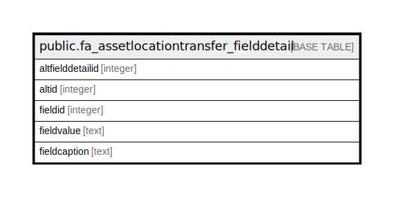

# public.fa_assetlocationtransfer_fielddetail

## Description

## Columns

| Name | Type | Default | Nullable | Children | Parents | Comment |
| ---- | ---- | ------- | -------- | -------- | ------- | ------- |
| altfielddetailid | integer | nextval('fa_assetlocationtransfer_fielddetail_seq'::regclass) | false |  |  |  |
| altid | integer |  | true |  |  |  |
| fieldid | integer |  | true |  |  |  |
| fieldvalue | text |  | true |  |  |  |
| fieldcaption | text |  | true |  |  |  |

## Indexes

| Name | Definition |
| ---- | ---------- |
| ui_alt_fd | CREATE UNIQUE INDEX ui_alt_fd ON public.fa_assetlocationtransfer_fielddetail USING btree (altid, fieldid) |

## Relations

---

> Generated by [tbls](https://github.com/k1LoW/tbls)
