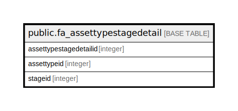

# public.fa_assettypestagedetail

## Description

## Columns

| Name | Type | Default | Nullable | Children | Parents | Comment |
| ---- | ---- | ------- | -------- | -------- | ------- | ------- |
| assettypestagedetailid | integer | nextval('fa_assettypestagedetail_assettypestagedetailid_seq'::regclass) | false |  |  |  |
| assettypeid | integer |  | true |  |  |  |
| stageid | integer |  | true |  |  |  |

## Constraints

| Name | Type | Definition |
| ---- | ---- | ---------- |
| fa_assettypestagedetail_pkey | PRIMARY KEY | PRIMARY KEY (assettypestagedetailid) |

## Indexes

| Name | Definition |
| ---- | ---------- |
| fa_assettypestagedetail_pkey | CREATE UNIQUE INDEX fa_assettypestagedetail_pkey ON public.fa_assettypestagedetail USING btree (assettypestagedetailid) |

## Relations

---

> Generated by [tbls](https://github.com/k1LoW/tbls)
