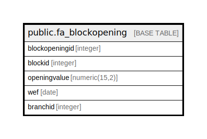

# public.fa_blockopening

## Description

## Columns

| Name | Type | Default | Nullable | Children | Parents | Comment |
| ---- | ---- | ------- | -------- | -------- | ------- | ------- |
| blockopeningid | integer | nextval('fa_blockopening_blockopeningid_seq'::regclass) | false |  |  |  |
| blockid | integer |  | true |  |  |  |
| openingvalue | numeric(15,2) |  | true |  |  |  |
| wef | date |  | true |  |  |  |
| branchid | integer |  | true |  |  |  |

## Constraints

| Name | Type | Definition |
| ---- | ---- | ---------- |
| fa_blockopening_pkey | PRIMARY KEY | PRIMARY KEY (blockopeningid) |

## Indexes

| Name | Definition |
| ---- | ---------- |
| fa_blockopening_pkey | CREATE UNIQUE INDEX fa_blockopening_pkey ON public.fa_blockopening USING btree (blockopeningid) |

## Relations

---

> Generated by [tbls](https://github.com/k1LoW/tbls)
