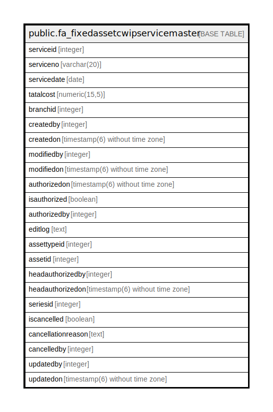

# public.fa_fixedassetcwipservicemaster

## Description

## Columns

| Name | Type | Default | Nullable | Children | Parents | Comment |
| ---- | ---- | ------- | -------- | -------- | ------- | ------- |
| serviceid | integer | nextval('fa_fixedassetcwipservicemaster_serviceid_seq'::regclass) | false |  |  |  |
| serviceno | varchar(20) |  | true |  |  |  |
| servicedate | date |  | true |  |  |  |
| tatalcost | numeric(15,5) |  | true |  |  |  |
| branchid | integer |  | true |  |  |  |
| createdby | integer |  | true |  |  |  |
| createdon | timestamp(6) without time zone | now() | true |  |  |  |
| modifiedby | integer |  | true |  |  |  |
| modifiedon | timestamp(6) without time zone |  | true |  |  |  |
| authorizedon | timestamp(6) without time zone |  | true |  |  |  |
| isauthorized | boolean | false | false |  |  |  |
| authorizedby | integer |  | true |  |  |  |
| editlog | text |  | true |  |  |  |
| assettypeid | integer |  | true |  |  |  |
| assetid | integer |  | true |  |  |  |
| headauthorizedby | integer |  | true |  |  |  |
| headauthorizedon | timestamp(6) without time zone |  | true |  |  |  |
| seriesid | integer |  | true |  |  |  |
| iscancelled | boolean | false | true |  |  |  |
| cancellationreason | text |  | true |  |  |  |
| cancelledby | integer |  | true |  |  |  |
| updatedby | integer |  | true |  |  |  |
| updatedon | timestamp(6) without time zone | NULL::timestamp without time zone | true |  |  |  |

## Constraints

| Name | Type | Definition |
| ---- | ---- | ---------- |
| fa_fixedassetcwipservicemaster_pkey | PRIMARY KEY | PRIMARY KEY (serviceid) |

## Indexes

| Name | Definition |
| ---- | ---------- |
| fa_fixedassetcwipservicemaster_pkey | CREATE UNIQUE INDEX fa_fixedassetcwipservicemaster_pkey ON public.fa_fixedassetcwipservicemaster USING btree (serviceid) |

## Relations

---

> Generated by [tbls](https://github.com/k1LoW/tbls)
