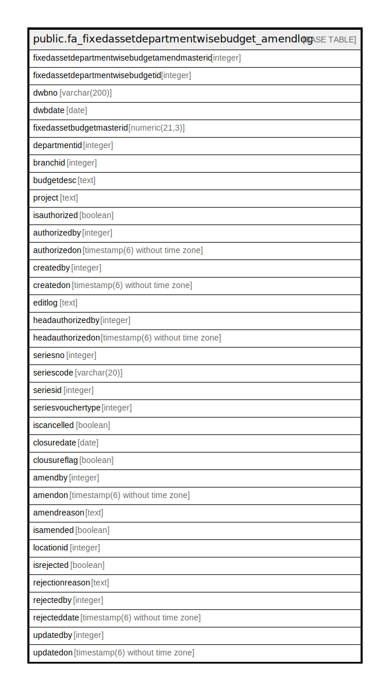

# public.fa_fixedassetdepartmentwisebudget_amendlog

## Description

## Columns

| Name | Type | Default | Nullable | Children | Parents | Comment |
| ---- | ---- | ------- | -------- | -------- | ------- | ------- |
| fixedassetdepartmentwisebudgetamendmasterid | integer | nextval('fa_fixedassetdepartmentwisebu_fixedassetdepartmentwisebudg_seq2'::regclass) | false |  |  |  |
| fixedassetdepartmentwisebudgetid | integer |  | true |  |  |  |
| dwbno | varchar(200) |  | true |  |  |  |
| dwbdate | date |  | true |  |  |  |
| fixedassetbudgetmasterid | numeric(21,3) |  | true |  |  |  |
| departmentid | integer |  | true |  |  |  |
| branchid | integer |  | true |  |  |  |
| budgetdesc | text |  | true |  |  |  |
| project | text |  | true |  |  |  |
| isauthorized | boolean | false | true |  |  |  |
| authorizedby | integer |  | true |  |  |  |
| authorizedon | timestamp(6) without time zone |  | true |  |  |  |
| createdby | integer |  | true |  |  |  |
| createdon | timestamp(6) without time zone | now() | true |  |  |  |
| editlog | text |  | true |  |  |  |
| headauthorizedby | integer |  | true |  |  |  |
| headauthorizedon | timestamp(6) without time zone |  | true |  |  |  |
| seriesno | integer |  | true |  |  |  |
| seriescode | varchar(20) |  | true |  |  |  |
| seriesid | integer |  | true |  |  |  |
| seriesvouchertype | integer |  | true |  |  |  |
| iscancelled | boolean |  | true |  |  |  |
| closuredate | date |  | true |  |  |  |
| clousureflag | boolean | false | true |  |  |  |
| amendby | integer |  | true |  |  |  |
| amendon | timestamp(6) without time zone |  | true |  |  |  |
| amendreason | text |  | true |  |  |  |
| isamended | boolean | false | true |  |  |  |
| locationid | integer | 0 | false |  |  |  |
| isrejected | boolean | false | true |  |  |  |
| rejectionreason | text |  | true |  |  |  |
| rejectedby | integer | 0 | true |  |  |  |
| rejecteddate | timestamp(6) without time zone | NULL::timestamp without time zone | true |  |  |  |
| updatedby | integer |  | true |  |  |  |
| updatedon | timestamp(6) without time zone | NULL::timestamp without time zone | true |  |  |  |

## Constraints

| Name | Type | Definition |
| ---- | ---- | ---------- |
| fixedassetdepartmentwisebudgetamendmasterid_pkey | PRIMARY KEY | PRIMARY KEY (fixedassetdepartmentwisebudgetamendmasterid) |

## Indexes

| Name | Definition |
| ---- | ---------- |
| fixedassetdepartmentwisebudgetamendmasterid_pkey | CREATE UNIQUE INDEX fixedassetdepartmentwisebudgetamendmasterid_pkey ON public.fa_fixedassetdepartmentwisebudget_amendlog USING btree (fixedassetdepartmentwisebudgetamendmasterid) |

## Relations

---

> Generated by [tbls](https://github.com/k1LoW/tbls)
