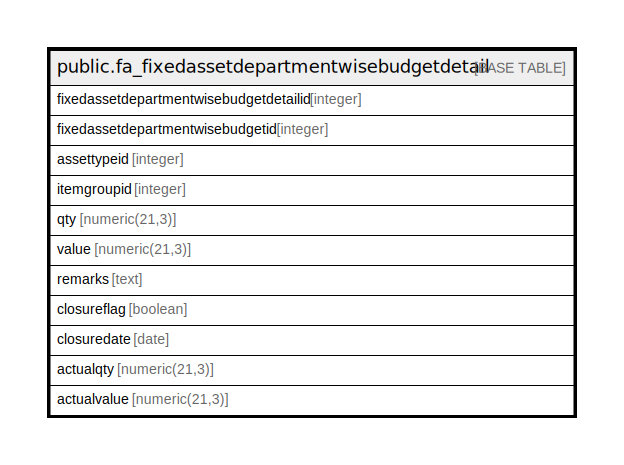

# public.fa_fixedassetdepartmentwisebudgetdetail

## Description

## Columns

| Name | Type | Default | Nullable | Children | Parents | Comment |
| ---- | ---- | ------- | -------- | -------- | ------- | ------- |
| fixedassetdepartmentwisebudgetdetailid | integer | nextval('fa_fixedassetdepartmentwisebu_fixedassetdepartmentwisebudg_seq1'::regclass) | false |  |  |  |
| fixedassetdepartmentwisebudgetid | integer |  | true |  |  |  |
| assettypeid | integer |  | true |  |  |  |
| itemgroupid | integer |  | true |  |  |  |
| qty | numeric(21,3) |  | true |  |  |  |
| value | numeric(21,3) |  | false |  |  |  |
| remarks | text |  | true |  |  |  |
| closureflag | boolean | false | true |  |  |  |
| closuredate | date |  | true |  |  |  |
| actualqty | numeric(21,3) | 0 | false |  |  |  |
| actualvalue | numeric(21,3) | 0 | false |  |  |  |

## Constraints

| Name | Type | Definition |
| ---- | ---- | ---------- |
| fa_fixedassetdepartmentwisebudgetdetail_pkey | PRIMARY KEY | PRIMARY KEY (fixedassetdepartmentwisebudgetdetailid) |

## Indexes

| Name | Definition |
| ---- | ---------- |
| fa_fixedassetdepartmentwisebudgetdetail_pkey | CREATE UNIQUE INDEX fa_fixedassetdepartmentwisebudgetdetail_pkey ON public.fa_fixedassetdepartmentwisebudgetdetail USING btree (fixedassetdepartmentwisebudgetdetailid) |

## Relations

---

> Generated by [tbls](https://github.com/k1LoW/tbls)
