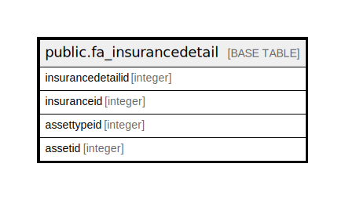

# public.fa_insurancedetail

## Description

## Columns

| Name | Type | Default | Nullable | Children | Parents | Comment |
| ---- | ---- | ------- | -------- | -------- | ------- | ------- |
| insurancedetailid | integer | nextval('fa_insurancedetail_insurancedetailid_seq'::regclass) | false |  |  |  |
| insuranceid | integer |  | true |  |  |  |
| assettypeid | integer |  | true |  |  |  |
| assetid | integer |  | true |  |  |  |

## Constraints

| Name | Type | Definition |
| ---- | ---- | ---------- |
| fa_insurancedetail_pkey | PRIMARY KEY | PRIMARY KEY (insurancedetailid) |

## Indexes

| Name | Definition |
| ---- | ---------- |
| fa_insurancedetail_pkey | CREATE UNIQUE INDEX fa_insurancedetail_pkey ON public.fa_insurancedetail USING btree (insurancedetailid) |

## Relations

---

> Generated by [tbls](https://github.com/k1LoW/tbls)
