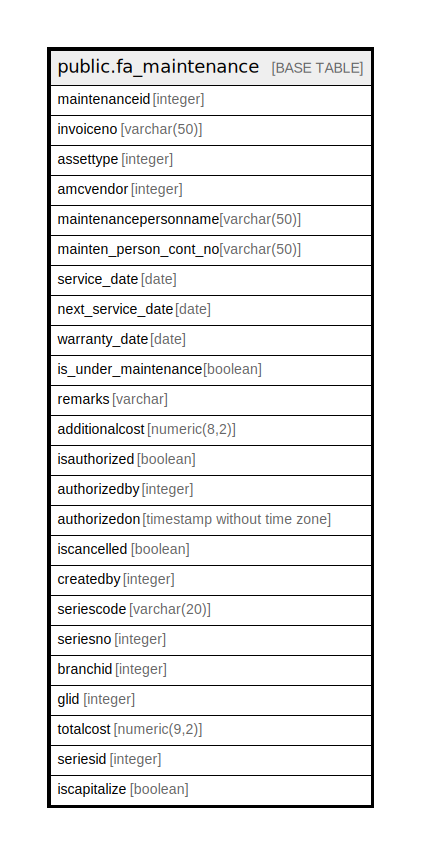

# public.fa_maintenance

## Description

## Columns

| Name | Type | Default | Nullable | Children | Parents | Comment |
| ---- | ---- | ------- | -------- | -------- | ------- | ------- |
| maintenanceid | integer | nextval('fa_maintenance_maintenanceid_seq'::regclass) | false |  |  |  |
| invoiceno | varchar(50) |  | true |  |  |  |
| assettype | integer |  | true |  |  |  |
| amcvendor | integer |  | true |  |  |  |
| maintenancepersonname | varchar(50) |  | true |  |  |  |
| mainten_person_cont_no | varchar(50) |  | true |  |  |  |
| service_date | date |  | true |  |  |  |
| next_service_date | date |  | true |  |  |  |
| warranty_date | date |  | true |  |  |  |
| is_under_maintenance | boolean |  | true |  |  |  |
| remarks | varchar |  | true |  |  |  |
| additionalcost | numeric(8,2) |  | true |  |  |  |
| isauthorized | boolean | false | true |  |  |  |
| authorizedby | integer |  | true |  |  |  |
| authorizedon | timestamp without time zone |  | true |  |  |  |
| iscancelled | boolean | false | true |  |  |  |
| createdby | integer |  | true |  |  |  |
| seriescode | varchar(20) |  | true |  |  |  |
| seriesno | integer |  | true |  |  |  |
| branchid | integer |  | true |  |  |  |
| glid | integer |  | true |  |  |  |
| totalcost | numeric(9,2) |  | true |  |  |  |
| seriesid | integer |  | true |  |  |  |
| iscapitalize | boolean | false | true |  |  |  |

## Constraints

| Name | Type | Definition |
| ---- | ---- | ---------- |
| fa_maintenance_pkey | PRIMARY KEY | PRIMARY KEY (maintenanceid) |

## Indexes

| Name | Definition |
| ---- | ---------- |
| fa_maintenance_pkey | CREATE UNIQUE INDEX fa_maintenance_pkey ON public.fa_maintenance USING btree (maintenanceid) |

## Relations

---

> Generated by [tbls](https://github.com/k1LoW/tbls)
