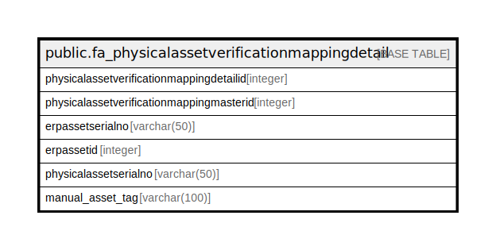

# public.fa_physicalassetverificationmappingdetail

## Description

## Columns

| Name | Type | Default | Nullable | Children | Parents | Comment |
| ---- | ---- | ------- | -------- | -------- | ------- | ------- |
| physicalassetverificationmappingdetailid | integer | nextval('fa_physicalassetverificationm_physicalassetverificationmap_seq1'::regclass) | false |  |  |  |
| physicalassetverificationmappingmasterid | integer |  | true |  |  |  |
| erpassetserialno | varchar(50) |  | true |  |  |  |
| erpassetid | integer |  | true |  |  |  |
| physicalassetserialno | varchar(50) |  | true |  |  |  |
| manual_asset_tag | varchar(100) | NULL::character varying | true |  |  |  |

## Constraints

| Name | Type | Definition |
| ---- | ---- | ---------- |
| pk_fa_physicalassetverificationmappingdetail_detailid | PRIMARY KEY | PRIMARY KEY (physicalassetverificationmappingdetailid) |

## Indexes

| Name | Definition |
| ---- | ---------- |
| pk_fa_physicalassetverificationmappingdetail_detailid | CREATE UNIQUE INDEX pk_fa_physicalassetverificationmappingdetail_detailid ON public.fa_physicalassetverificationmappingdetail USING btree (physicalassetverificationmappingdetailid) |

## Relations

---

> Generated by [tbls](https://github.com/k1LoW/tbls)
