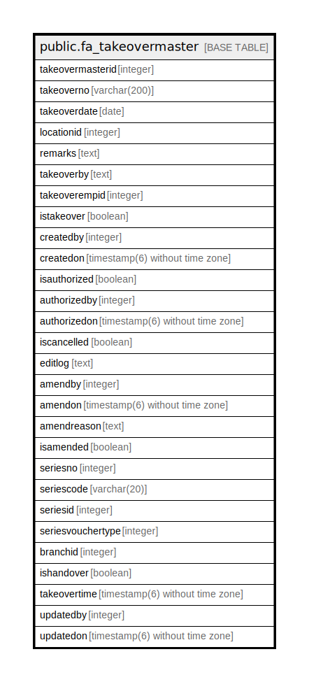

# public.fa_takeovermaster

## Description

## Columns

| Name | Type | Default | Nullable | Children | Parents | Comment |
| ---- | ---- | ------- | -------- | -------- | ------- | ------- |
| takeovermasterid | integer | nextval('fa_takeovermaster_takeovermasterid_seq'::regclass) | false |  |  |  |
| takeoverno | varchar(200) |  | true |  |  |  |
| takeoverdate | date |  | true |  |  |  |
| locationid | integer |  | true |  |  |  |
| remarks | text |  | true |  |  |  |
| takeoverby | text |  | true |  |  |  |
| takeoverempid | integer |  | true |  |  |  |
| istakeover | boolean |  | true |  |  |  |
| createdby | integer |  | true |  |  |  |
| createdon | timestamp(6) without time zone | now() | true |  |  |  |
| isauthorized | boolean | false | true |  |  |  |
| authorizedby | integer |  | true |  |  |  |
| authorizedon | timestamp(6) without time zone |  | true |  |  |  |
| iscancelled | boolean |  | true |  |  |  |
| editlog | text |  | true |  |  |  |
| amendby | integer |  | true |  |  |  |
| amendon | timestamp(6) without time zone |  | true |  |  |  |
| amendreason | text |  | true |  |  |  |
| isamended | boolean | false | true |  |  |  |
| seriesno | integer |  | true |  |  |  |
| seriescode | varchar(20) |  | true |  |  |  |
| seriesid | integer |  | true |  |  |  |
| seriesvouchertype | integer |  | true |  |  |  |
| branchid | integer |  | true |  |  |  |
| ishandover | boolean |  | true |  |  |  |
| takeovertime | timestamp(6) without time zone |  | true |  |  |  |
| updatedby | integer |  | true |  |  |  |
| updatedon | timestamp(6) without time zone | NULL::timestamp without time zone | true |  |  |  |

## Constraints

| Name | Type | Definition |
| ---- | ---- | ---------- |
| fa_takeovermaster_pkey | PRIMARY KEY | PRIMARY KEY (takeovermasterid) |

## Indexes

| Name | Definition |
| ---- | ---------- |
| fa_takeovermaster_pkey | CREATE UNIQUE INDEX fa_takeovermaster_pkey ON public.fa_takeovermaster USING btree (takeovermasterid) |

## Relations

---

> Generated by [tbls](https://github.com/k1LoW/tbls)
