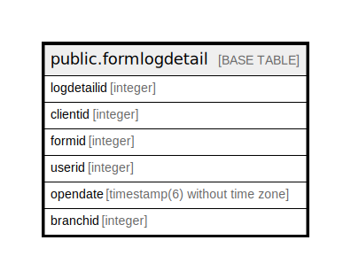

# public.formlogdetail

## Description

## Columns

| Name | Type | Default | Nullable | Children | Parents | Comment |
| ---- | ---- | ------- | -------- | -------- | ------- | ------- |
| logdetailid | integer | nextval('formlogdetail_logdetailid_seq'::regclass) | false |  |  |  |
| clientid | integer |  | true |  |  |  |
| formid | integer |  | true |  |  |  |
| userid | integer |  | true |  |  |  |
| opendate | timestamp(6) without time zone | now() | false |  |  |  |
| branchid | integer |  | true |  |  |  |

## Constraints

| Name | Type | Definition |
| ---- | ---- | ---------- |
| formlogdetail_pkey | PRIMARY KEY | PRIMARY KEY (logdetailid) |

## Indexes

| Name | Definition |
| ---- | ---------- |
| formlogdetail_pkey | CREATE UNIQUE INDEX formlogdetail_pkey ON public.formlogdetail USING btree (logdetailid) |

## Relations

---

> Generated by [tbls](https://github.com/k1LoW/tbls)
