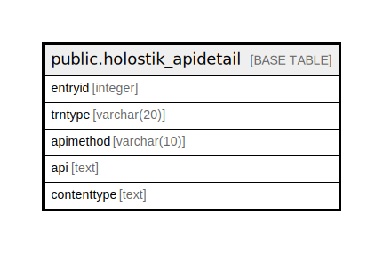

# public.holostik_apidetail

## Description

## Columns

| Name | Type | Default | Nullable | Children | Parents | Comment |
| ---- | ---- | ------- | -------- | -------- | ------- | ------- |
| entryid | integer | nextval('holostik_apidetail_entryid_seq'::regclass) | false |  |  |  |
| trntype | varchar(20) |  | true |  |  |  |
| apimethod | varchar(10) |  | true |  |  |  |
| api | text |  | true |  |  |  |
| contenttype | text |  | true |  |  |  |

## Constraints

| Name | Type | Definition |
| ---- | ---- | ---------- |
| pk_holostik_apidetail | PRIMARY KEY | PRIMARY KEY (entryid) |

## Indexes

| Name | Definition |
| ---- | ---------- |
| pk_holostik_apidetail | CREATE UNIQUE INDEX pk_holostik_apidetail ON public.holostik_apidetail USING btree (entryid) |

## Relations

---

> Generated by [tbls](https://github.com/k1LoW/tbls)
