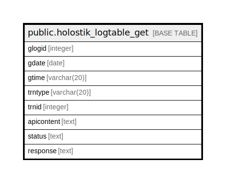

# public.holostik_logtable_get

## Description

## Columns

| Name | Type | Default | Nullable | Children | Parents | Comment |
| ---- | ---- | ------- | -------- | -------- | ------- | ------- |
| glogid | integer | nextval('holostik_logtable_get_glogid_seq'::regclass) | false |  |  |  |
| gdate | date |  | true |  |  |  |
| gtime | varchar(20) |  | true |  |  |  |
| trntype | varchar(20) |  | true |  |  |  |
| trnid | integer |  | true |  |  |  |
| apicontent | text |  | true |  |  |  |
| status | text |  | true |  |  |  |
| response | text |  | true |  |  |  |

## Constraints

| Name | Type | Definition |
| ---- | ---- | ---------- |
| pk_holostik_logtable_get | PRIMARY KEY | PRIMARY KEY (glogid) |

## Indexes

| Name | Definition |
| ---- | ---------- |
| pk_holostik_logtable_get | CREATE UNIQUE INDEX pk_holostik_logtable_get ON public.holostik_logtable_get USING btree (glogid) |

## Triggers

| Name | Definition |
| ---- | ---------- |
| trg_clear_log | CREATE TRIGGER trg_clear_log AFTER INSERT OR UPDATE ON public.holostik_logtable_get FOR EACH ROW EXECUTE FUNCTION clear_log() |

## Relations

---

> Generated by [tbls](https://github.com/k1LoW/tbls)
