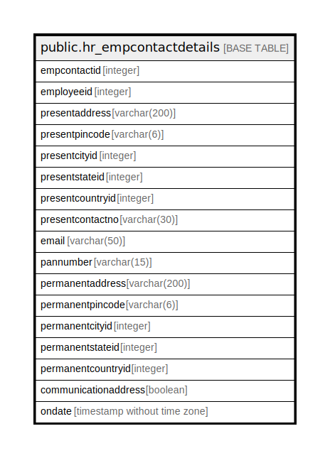

# public.hr_empcontactdetails

## Description

## Columns

| Name | Type | Default | Nullable | Children | Parents | Comment |
| ---- | ---- | ------- | -------- | -------- | ------- | ------- |
| empcontactid | integer | nextval('hr_empcontactdetails_empcontactid_seq'::regclass) | false |  |  |  |
| employeeid | integer |  | true |  |  |  |
| presentaddress | varchar(200) |  | true |  |  |  |
| presentpincode | varchar(6) |  | true |  |  |  |
| presentcityid | integer |  | true |  |  |  |
| presentstateid | integer |  | true |  |  |  |
| presentcountryid | integer |  | true |  |  |  |
| presentcontactno | varchar(30) |  | true |  |  |  |
| email | varchar(50) |  | true |  |  |  |
| pannumber | varchar(15) |  | true |  |  |  |
| permanentaddress | varchar(200) |  | true |  |  |  |
| permanentpincode | varchar(6) |  | true |  |  |  |
| permanentcityid | integer |  | true |  |  |  |
| permanentstateid | integer |  | true |  |  |  |
| permanentcountryid | integer |  | true |  |  |  |
| communicationaddress | boolean |  | true |  |  |  |
| ondate | timestamp without time zone | now() | true |  |  |  |

## Constraints

| Name | Type | Definition |
| ---- | ---- | ---------- |
| hr_empcontactdetails_pkey | PRIMARY KEY | PRIMARY KEY (empcontactid) |

## Indexes

| Name | Definition |
| ---- | ---------- |
| hr_empcontactdetails_pkey | CREATE UNIQUE INDEX hr_empcontactdetails_pkey ON public.hr_empcontactdetails USING btree (empcontactid) |

## Relations

---

> Generated by [tbls](https://github.com/k1LoW/tbls)
