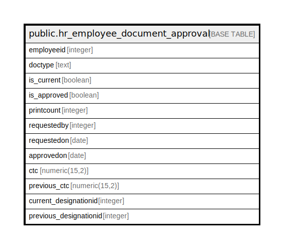

# public.hr_employee_document_approval

## Description

## Columns

| Name | Type | Default | Nullable | Children | Parents | Comment |
| ---- | ---- | ------- | -------- | -------- | ------- | ------- |
| employeeid | integer |  | true |  |  |  |
| doctype | text |  | true |  |  |  |
| is_current | boolean | false | true |  |  |  |
| is_approved | boolean | false | true |  |  |  |
| printcount | integer | 0 | true |  |  |  |
| requestedby | integer |  | true |  |  |  |
| requestedon | date |  | true |  |  |  |
| approvedon | date |  | true |  |  |  |
| ctc | numeric(15,2) |  | true |  |  |  |
| previous_ctc | numeric(15,2) |  | true |  |  |  |
| current_designationid | integer |  | true |  |  |  |
| previous_designationid | integer |  | true |  |  |  |

## Relations

---

> Generated by [tbls](https://github.com/k1LoW/tbls)
