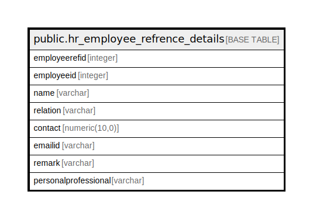

# public.hr_employee_refrence_details

## Description

## Columns

| Name | Type | Default | Nullable | Children | Parents | Comment |
| ---- | ---- | ------- | -------- | -------- | ------- | ------- |
| employeerefid | integer | nextval('hr_employee_refrence_details_employeerefid_seq'::regclass) | false |  |  |  |
| employeeid | integer |  | true |  |  |  |
| name | varchar |  | true |  |  |  |
| relation | varchar |  | true |  |  |  |
| contact | numeric(10,0) |  | true |  |  |  |
| emailid | varchar |  | true |  |  |  |
| remark | varchar |  | true |  |  |  |
| personalprofessional | varchar |  | true |  |  |  |

## Constraints

| Name | Type | Definition |
| ---- | ---- | ---------- |
| hr_employee_refrence_details_pkey | PRIMARY KEY | PRIMARY KEY (employeerefid) |

## Indexes

| Name | Definition |
| ---- | ---------- |
| hr_employee_refrence_details_pkey | CREATE UNIQUE INDEX hr_employee_refrence_details_pkey ON public.hr_employee_refrence_details USING btree (employeerefid) |

## Relations

---

> Generated by [tbls](https://github.com/k1LoW/tbls)
