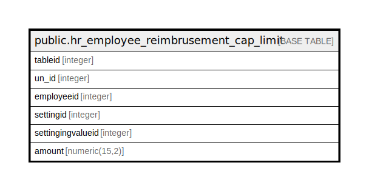

# public.hr_employee_reimbrusement_cap_limit

## Description

## Columns

| Name | Type | Default | Nullable | Children | Parents | Comment |
| ---- | ---- | ------- | -------- | -------- | ------- | ------- |
| tableid | integer | nextval('hr_employee_reimbrusement_cap_limit_tableid_seq'::regclass) | false |  |  |  |
| un_id | integer |  | true |  |  |  |
| employeeid | integer |  | true |  |  |  |
| settingid | integer |  | true |  |  |  |
| settingingvalueid | integer |  | true |  |  |  |
| amount | numeric(15,2) |  | true |  |  |  |

## Constraints

| Name | Type | Definition |
| ---- | ---- | ---------- |
| hr_employee_reimbrusement_cap_limit_pkey | PRIMARY KEY | PRIMARY KEY (tableid) |

## Indexes

| Name | Definition |
| ---- | ---------- |
| hr_employee_reimbrusement_cap_limit_pkey | CREATE UNIQUE INDEX hr_employee_reimbrusement_cap_limit_pkey ON public.hr_employee_reimbrusement_cap_limit USING btree (tableid) |

## Relations

---

> Generated by [tbls](https://github.com/k1LoW/tbls)
