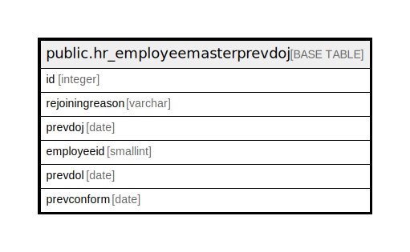

# public.hr_employeemasterprevdoj

## Description

## Columns

| Name | Type | Default | Nullable | Children | Parents | Comment |
| ---- | ---- | ------- | -------- | -------- | ------- | ------- |
| id | integer | nextval('hr_employeemasterprevdoj_id_seq'::regclass) | false |  |  |  |
| rejoiningreason | varchar |  | true |  |  |  |
| prevdoj | date |  | true |  |  |  |
| employeeid | smallint |  | true |  |  |  |
| prevdol | date |  | true |  |  |  |
| prevconform | date |  | true |  |  |  |

## Constraints

| Name | Type | Definition |
| ---- | ---- | ---------- |
| hr_employeemasterprevdoj_pkey | PRIMARY KEY | PRIMARY KEY (id) |

## Indexes

| Name | Definition |
| ---- | ---------- |
| hr_employeemasterprevdoj_pkey | CREATE UNIQUE INDEX hr_employeemasterprevdoj_pkey ON public.hr_employeemasterprevdoj USING btree (id) |

## Relations

---

> Generated by [tbls](https://github.com/k1LoW/tbls)
