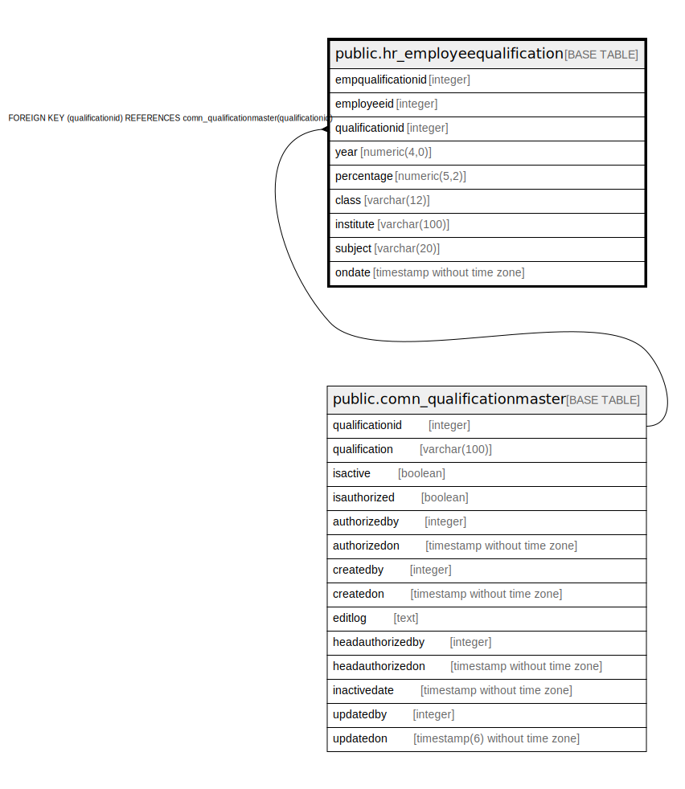

# public.hr_employeequalification

## Description

## Columns

| Name | Type | Default | Nullable | Children | Parents | Comment |
| ---- | ---- | ------- | -------- | -------- | ------- | ------- |
| empqualificationid | integer | nextval('hr_employeequalification_empqualificationid_seq'::regclass) | false |  |  |  |
| employeeid | integer |  | true |  |  |  |
| qualificationid | integer |  | true |  | [public.comn_qualificationmaster](public.comn_qualificationmaster.md) |  |
| year | numeric(4,0) |  | true |  |  |  |
| percentage | numeric(5,2) |  | true |  |  |  |
| class | varchar(12) |  | true |  |  |  |
| institute | varchar(100) |  | true |  |  |  |
| subject | varchar(20) |  | true |  |  |  |
| ondate | timestamp without time zone | now() | true |  |  |  |

## Constraints

| Name | Type | Definition |
| ---- | ---- | ---------- |
| employeequalification_pkey | PRIMARY KEY | PRIMARY KEY (empqualificationid) |
| employeequalification_fk | FOREIGN KEY | FOREIGN KEY (qualificationid) REFERENCES comn_qualificationmaster(qualificationid) |

## Indexes

| Name | Definition |
| ---- | ---------- |
| employeequalification_pkey | CREATE UNIQUE INDEX employeequalification_pkey ON public.hr_employeequalification USING btree (empqualificationid) |

## Relations

---

> Generated by [tbls](https://github.com/k1LoW/tbls)
