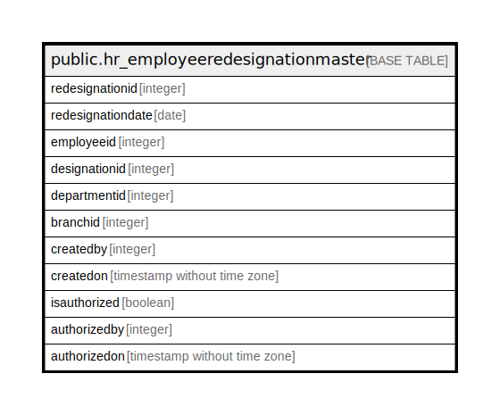

# public.hr_employeeredesignationmaster

## Description

## Columns

| Name | Type | Default | Nullable | Children | Parents | Comment |
| ---- | ---- | ------- | -------- | -------- | ------- | ------- |
| redesignationid | integer | nextval('hr_employeeredesignationmaster_redesignationid_seq'::regclass) | false |  |  |  |
| redesignationdate | date |  | true |  |  |  |
| employeeid | integer |  | true |  |  |  |
| designationid | integer |  | true |  |  |  |
| departmentid | integer |  | true |  |  |  |
| branchid | integer |  | true |  |  |  |
| createdby | integer |  | true |  |  |  |
| createdon | timestamp without time zone | now() | true |  |  |  |
| isauthorized | boolean | false | false |  |  |  |
| authorizedby | integer |  | true |  |  |  |
| authorizedon | timestamp without time zone |  | true |  |  |  |

## Constraints

| Name | Type | Definition |
| ---- | ---- | ---------- |
| hr_employeeredesignation_pkey | PRIMARY KEY | PRIMARY KEY (redesignationid) |

## Indexes

| Name | Definition |
| ---- | ---------- |
| hr_employeeredesignation_pkey | CREATE UNIQUE INDEX hr_employeeredesignation_pkey ON public.hr_employeeredesignationmaster USING btree (redesignationid) |

## Relations

---

> Generated by [tbls](https://github.com/k1LoW/tbls)
