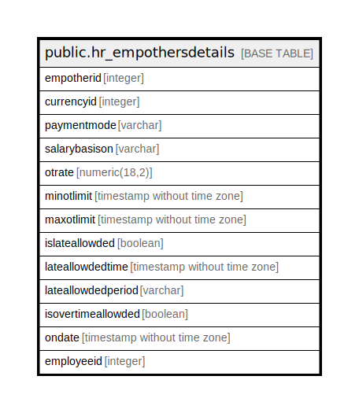

# public.hr_empothersdetails

## Description

## Columns

| Name | Type | Default | Nullable | Children | Parents | Comment |
| ---- | ---- | ------- | -------- | -------- | ------- | ------- |
| empotherid | integer | nextval('hr_empothersdetails_empotherid_seq'::regclass) | false |  |  |  |
| currencyid | integer |  | true |  |  |  |
| paymentmode | varchar |  | true |  |  |  |
| salarybasison | varchar |  | true |  |  |  |
| otrate | numeric(18,2) |  | true |  |  |  |
| minotlimit | timestamp without time zone |  | true |  |  |  |
| maxotlimit | timestamp without time zone |  | true |  |  |  |
| islateallowded | boolean |  | true |  |  |  |
| lateallowdedtime | timestamp without time zone |  | true |  |  |  |
| lateallowdedperiod | varchar |  | true |  |  |  |
| isovertimeallowded | boolean |  | true |  |  |  |
| ondate | timestamp without time zone | now() | true |  |  |  |
| employeeid | integer |  | true |  |  |  |

## Constraints

| Name | Type | Definition |
| ---- | ---- | ---------- |
| hr_empothersdetails_pkey | PRIMARY KEY | PRIMARY KEY (empotherid) |

## Indexes

| Name | Definition |
| ---- | ---------- |
| hr_empothersdetails_pkey | CREATE UNIQUE INDEX hr_empothersdetails_pkey ON public.hr_empothersdetails USING btree (empotherid) |

## Relations

---

> Generated by [tbls](https://github.com/k1LoW/tbls)
