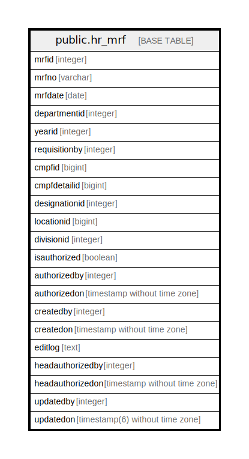

# public.hr_mrf

## Description

## Columns

| Name | Type | Default | Nullable | Children | Parents | Comment |
| ---- | ---- | ------- | -------- | -------- | ------- | ------- |
| mrfid | integer | nextval('hr_mrf_mrfid_seq'::regclass) | false |  |  |  |
| mrfno | varchar |  | false |  |  |  |
| mrfdate | date |  | false |  |  |  |
| departmentid | integer |  | false |  |  |  |
| yearid | integer |  | false |  |  |  |
| requisitionby | integer |  | false |  |  |  |
| cmpfid | bigint |  | true |  |  |  |
| cmpfdetailid | bigint |  | true |  |  |  |
| designationid | integer |  | true |  |  |  |
| locationid | bigint |  | true |  |  |  |
| divisionid | integer |  | true |  |  |  |
| isauthorized | boolean | false | false |  |  |  |
| authorizedby | integer |  | true |  |  |  |
| authorizedon | timestamp without time zone |  | true |  |  |  |
| createdby | integer |  | true |  |  |  |
| createdon | timestamp without time zone | now() | true |  |  |  |
| editlog | text |  | true |  |  |  |
| headauthorizedby | integer |  | true |  |  |  |
| headauthorizedon | timestamp without time zone |  | true |  |  |  |
| updatedby | integer |  | true |  |  |  |
| updatedon | timestamp(6) without time zone | NULL::timestamp without time zone | true |  |  |  |

## Constraints

| Name | Type | Definition |
| ---- | ---- | ---------- |
| hr_mrf_pkey | PRIMARY KEY | PRIMARY KEY (mrfid) |

## Indexes

| Name | Definition |
| ---- | ---------- |
| hr_mrf_pkey | CREATE UNIQUE INDEX hr_mrf_pkey ON public.hr_mrf USING btree (mrfid) |
| uq_mrfno | CREATE UNIQUE INDEX uq_mrfno ON public.hr_mrf USING btree (lower((mrfno)::text)) |

## Relations

---

> Generated by [tbls](https://github.com/k1LoW/tbls)
