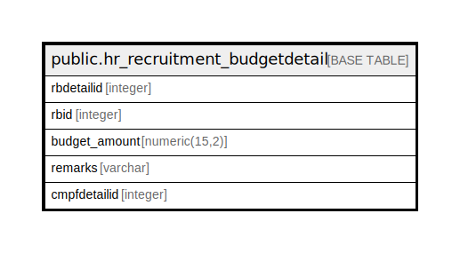

# public.hr_recruitment_budgetdetail

## Description

## Columns

| Name | Type | Default | Nullable | Children | Parents | Comment |
| ---- | ---- | ------- | -------- | -------- | ------- | ------- |
| rbdetailid | integer | nextval('hr_recruitment_budgetdetail_rbdetailid_seq'::regclass) | false |  |  |  |
| rbid | integer |  | false |  |  |  |
| budget_amount | numeric(15,2) |  | false |  |  |  |
| remarks | varchar |  | true |  |  |  |
| cmpfdetailid | integer |  | false |  |  |  |

## Constraints

| Name | Type | Definition |
| ---- | ---- | ---------- |
| hr_recruitment_budgetdetail_pkey | PRIMARY KEY | PRIMARY KEY (rbdetailid) |

## Indexes

| Name | Definition |
| ---- | ---------- |
| hr_recruitment_budgetdetail_pkey | CREATE UNIQUE INDEX hr_recruitment_budgetdetail_pkey ON public.hr_recruitment_budgetdetail USING btree (rbdetailid) |

## Relations

---

> Generated by [tbls](https://github.com/k1LoW/tbls)
