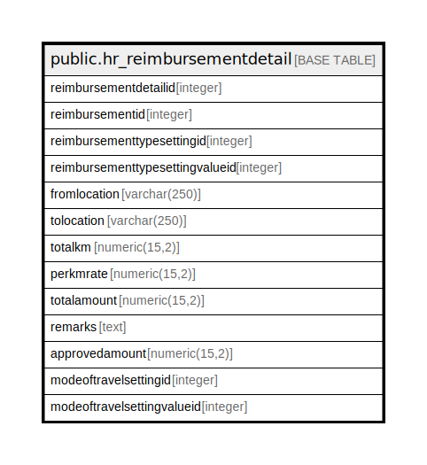

# public.hr_reimbursementdetail

## Description

## Columns

| Name | Type | Default | Nullable | Children | Parents | Comment |
| ---- | ---- | ------- | -------- | -------- | ------- | ------- |
| reimbursementdetailid | integer | nextval('hr_reimbursementdetail_reimbursementdetailid_seq'::regclass) | false |  |  |  |
| reimbursementid | integer |  | true |  |  |  |
| reimbursementtypesettingid | integer |  | true |  |  |  |
| reimbursementtypesettingvalueid | integer |  | true |  |  |  |
| fromlocation | varchar(250) |  | true |  |  |  |
| tolocation | varchar(250) |  | true |  |  |  |
| totalkm | numeric(15,2) |  | true |  |  |  |
| perkmrate | numeric(15,2) |  | true |  |  |  |
| totalamount | numeric(15,2) |  | true |  |  |  |
| remarks | text |  | true |  |  |  |
| approvedamount | numeric(15,2) |  | true |  |  |  |
| modeoftravelsettingid | integer |  | true |  |  |  |
| modeoftravelsettingvalueid | integer |  | true |  |  |  |

## Constraints

| Name | Type | Definition |
| ---- | ---- | ---------- |
| hr_reimbursementdetail_pkey | PRIMARY KEY | PRIMARY KEY (reimbursementdetailid) |

## Indexes

| Name | Definition |
| ---- | ---------- |
| hr_reimbursementdetail_pkey | CREATE UNIQUE INDEX hr_reimbursementdetail_pkey ON public.hr_reimbursementdetail USING btree (reimbursementdetailid) |

## Relations

---

> Generated by [tbls](https://github.com/k1LoW/tbls)
