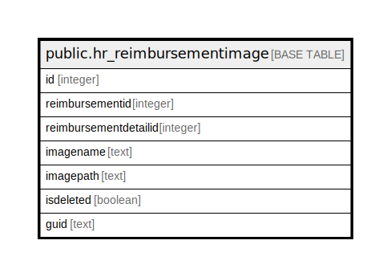

# public.hr_reimbursementimage

## Description

## Columns

| Name | Type | Default | Nullable | Children | Parents | Comment |
| ---- | ---- | ------- | -------- | -------- | ------- | ------- |
| id | integer | nextval('hr_reimbursementimage_id_seq'::regclass) | false |  |  |  |
| reimbursementid | integer |  | true |  |  |  |
| reimbursementdetailid | integer |  | true |  |  |  |
| imagename | text |  | true |  |  |  |
| imagepath | text |  | true |  |  |  |
| isdeleted | boolean | false | true |  |  |  |
| guid | text |  | true |  |  |  |

## Constraints

| Name | Type | Definition |
| ---- | ---- | ---------- |
| hr_hr_reimbursementimage_pkey | PRIMARY KEY | PRIMARY KEY (id) |

## Indexes

| Name | Definition |
| ---- | ---------- |
| hr_hr_reimbursementimage_pkey | CREATE UNIQUE INDEX hr_hr_reimbursementimage_pkey ON public.hr_reimbursementimage USING btree (id) |

## Relations

---

> Generated by [tbls](https://github.com/k1LoW/tbls)
