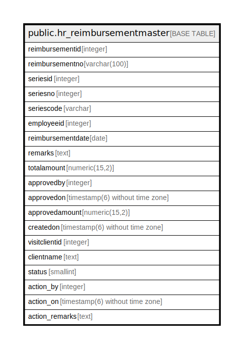

# public.hr_reimbursementmaster

## Description

## Columns

| Name | Type | Default | Nullable | Children | Parents | Comment |
| ---- | ---- | ------- | -------- | -------- | ------- | ------- |
| reimbursementid | integer | nextval('hr_reimbursementmaster_reimbursementid_seq'::regclass) | false |  |  |  |
| reimbursementno | varchar(100) |  | true |  |  |  |
| seriesid | integer |  | true |  |  |  |
| seriesno | integer |  | true |  |  |  |
| seriescode | varchar |  | true |  |  |  |
| employeeid | integer |  | true |  |  |  |
| reimbursementdate | date |  | true |  |  |  |
| remarks | text |  | true |  |  |  |
| totalamount | numeric(15,2) |  | true |  |  |  |
| approvedby | integer |  | true |  |  |  |
| approvedon | timestamp(6) without time zone |  | true |  |  |  |
| approvedamount | numeric(15,2) |  | true |  |  |  |
| createdon | timestamp(6) without time zone |  | true |  |  |  |
| visitclientid | integer |  | true |  |  |  |
| clientname | text | ''::text | true |  |  |  |
| status | smallint | 0 | true |  |  | 0=Pending,1=Cancel,2=Reject,3=In Process,4=Approve |
| action_by | integer |  | true |  |  |  |
| action_on | timestamp(6) without time zone | now() | true |  |  |  |
| action_remarks | text |  | true |  |  |  |

## Constraints

| Name | Type | Definition |
| ---- | ---- | ---------- |
| hr_reimbursementmaster_pkey | PRIMARY KEY | PRIMARY KEY (reimbursementid) |

## Indexes

| Name | Definition |
| ---- | ---------- |
| hr_reimbursementmaster_pkey | CREATE UNIQUE INDEX hr_reimbursementmaster_pkey ON public.hr_reimbursementmaster USING btree (reimbursementid) |

## Relations

---

> Generated by [tbls](https://github.com/k1LoW/tbls)
